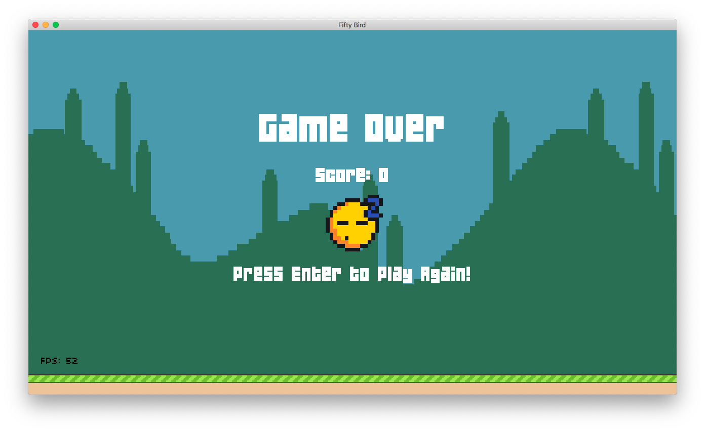
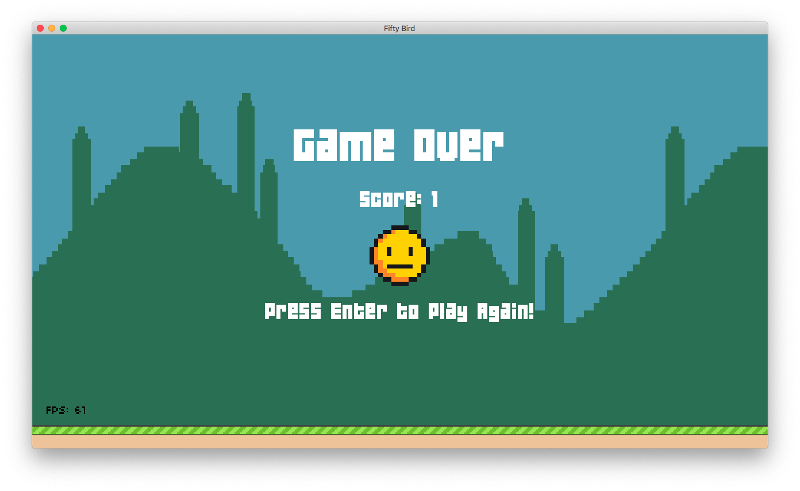
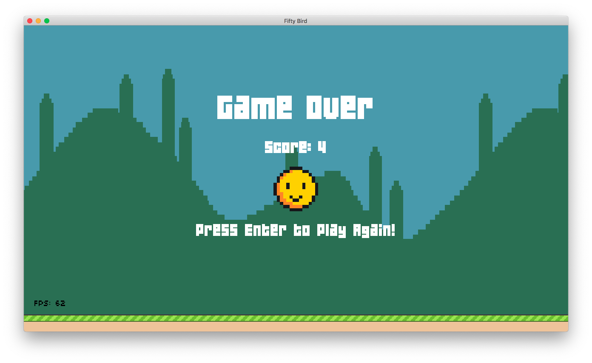
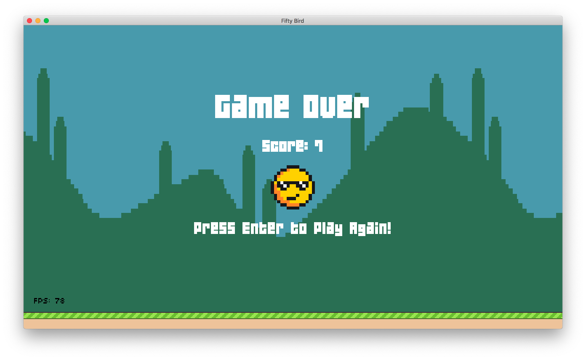

# Fifty Bird

Clone of Flappy Bird, implemented in Lua with LÖVE.

## Assignment 1: “Flappy Bird, The Reward Update”

Code for **Assignment 1** of [CS50's Introduction to Game Development](https://online-learning.harvard.edu/course/cs50s-introduction-game-development).

### [Assignment Goals](https://docs.cs50.net/games/2020/x/assignments/1/assignment1.html)

- [x] Randomize the gap between pipes (vertical space), such that they’re no longer hardcoded to 90 pixels.
- [x] Randomize the interval at which pairs of pipes spawn, such that they’re no longer always 2 seconds apart.
- [x] When a player enters the ScoreState, award them a “medal” via an image displayed along with the score; this can be any image or any type of medal you choose (e.g., ribbons, actual medals, trophies, etc.), so long as each is different and based on the points they scored that life. Choose 3 different ones, as well as the minimum score needed for each one (though make it fair and not too hard to test :)).

| Score | Screenshot |
| :---:  |  :---:      |
| `0`   |  |
| `1-3` |  |
| `4-6` |  |
| `7+` |  |

- [x] Implement a pause feature, such that the user can simply press “P” (or some other key) and pause the state of the game. This pause effect will be slightly fancier than the pause feature we showed in class, though not ultimately that much different. When they pause the game, a simple sound effect should play (I recommend testing out bfxr for this, as seen in Lecture 0!). At the same time this sound effect plays, the music should pause, and once the user presses P again, the gameplay and the music should resume just as they were! To cap it off, display a pause icon in the middle of the screen, nice and large, so as to make it clear the game is paused.


### Additional Changes

- Assets loaded before the `love.graphics.setDefaultFilter('nearest', 'nearest')` function is called are rendered using the default [FilterMode](https://love2d.org/wiki/FilterMode) (`linear`). Fixed by calling `:setFilter('nearest','nearest')` on the affected assets.

## Run the Game

```bash
cd fifty-bird
love .
```

### Score State

Show just the score state to demo the different _"awards"_.

```bash
cd fifty-bird
TEST_SCORE=3
love . score $TEST_SCORE

# or just try them all
for i in 0 1 4 7; do love . score $i; done
```

## Notes

The code has been upgraded to run on the latest version of LÖVE 2D —11.3 (Mysterious Mysteries).

# Credits

- [Pixel icon pack](https://just-a-cookie.itch.io/pixel-icon-pack)
- [slot machine (lydian).mp3](https://freesound.org/s/118238/)
